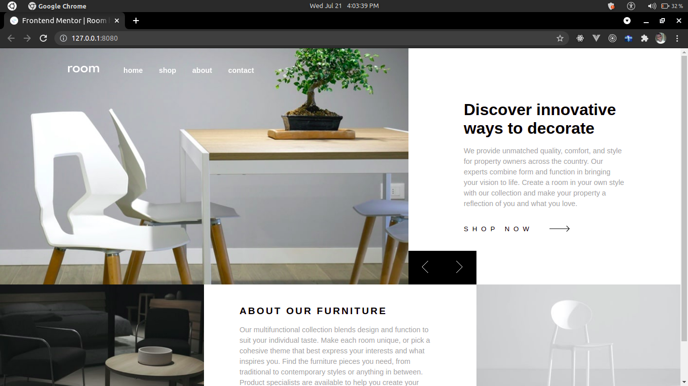

# Frontend Mentor - Room homepage solution

This is a solution to the [Room homepage challenge on Frontend Mentor](https://www.frontendmentor.io/challenges/room-homepage-BtdBY_ENq). Frontend Mentor challenges help you improve your coding skills by building realistic projects.

## Table of contents

- [Overview](#overview)
  - [The challenge](#the-challenge)
  - [Screenshot](#screenshot)
  - [Links](#links)
- [My process](#my-process)
  - [Built with](#built-with)
- [Author](#author)

## Overview

well, sha check it out.

### The challenge

Users should be able to:

- View the optimal layout for the site depending on their device's screen size
- See hover states for all interactive elements on the page
- Navigate the slider using either their mouse/trackpad or keyboard

### Screenshot

### Links

- Solution URL: [Add solution URL here](https://github.com/Pherwerz/room-homepage-master)
- Live Site URL: [live site](https://room-homepage-master-ruddy.vercel.app/)

## My process

### Built with

- Semantic HTML5 markup
- CSS custom properties
- Flexbox
- CSS Grid
- [sass](https://sass-lang.com/) - Sass for easy styling

## Author

- Website - [pherwerz](https://www.pherwerz.vercel.app)
- Frontend Mentor - [@pherwerz](https://www.frontendmentor.io/profile/pherwerz)
- Twitter - [@pherwerzz](https://www.twitter.com/pherwerzz)
